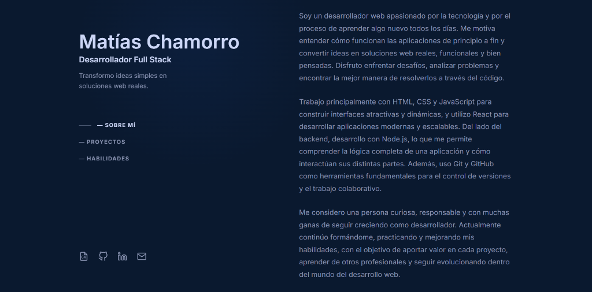

# 🎨 Portafolio Personal - Matías Chamorro

Desarrollador Full Stack apasionado por crear soluciones web reales, funcionales y bien pensadas.



## ✍️ Sobre Mí

Soy un desarrollador web con enfoque en entender el funcionamiento de las aplicaciones de principio a fin. Disfruto enfrentar desafíos, analizar problemas y encontrar la mejor manera de resolverlos a través del código.

### 🛠️ Stack Tecnológico
- **Frontend:** HTML5, CSS3, JavaScript (ES6+), React.
- **Backend:** Node.js.
- **Herramientas:** Git, GitHub, Vite.

---

## ⚙️ Instalación y Uso Local

```bash
# 1. Clonar el proyecto
git clone https://github.com/Matia163/portafolio.git

# 2. Instalar dependencias
npm install

# 3. Iniciar servidor de desarrollo
npm run dev
```

---

## � Contacto
- [LinkedIn](https://www.linkedin.com/in/matichamorro)
- [GitHub](https://github.com/Matia163)

## 📄 Licencia
Este proyecto utiliza código bajo la licencia MIT del repositorio original de [Brittany Chiang](https://github.com/bchiang7/v4).
